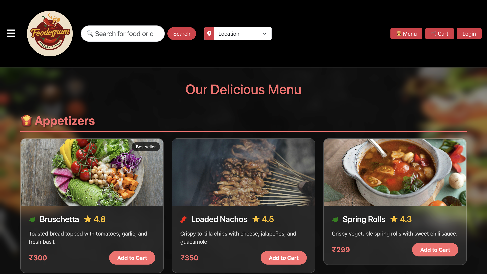
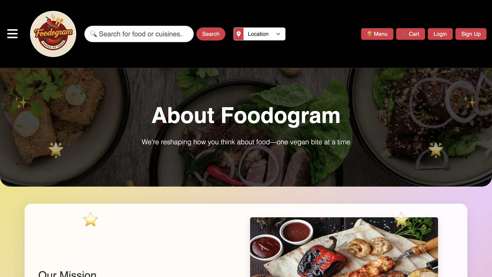
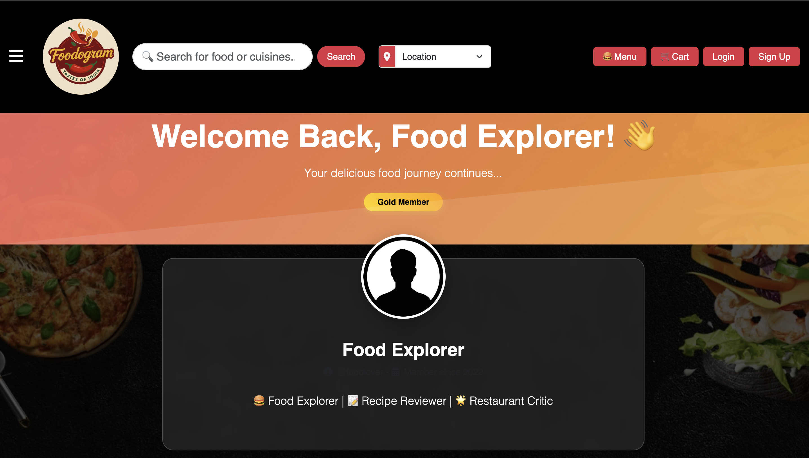
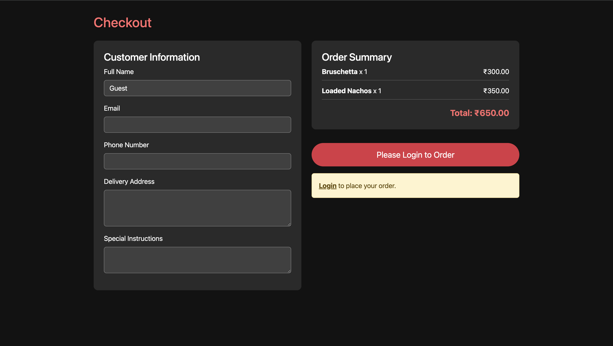

<a name="top"></a>

<div align="center">

 **🍔 Foodogram – Online Food Ordering Website**


[🌐 View Live Project](https://foodogram.infinityfreeapp.com)

</div>

---

**Foodogram** is a **dynamic online food ordering platform** that lets users browse menus, add items to cart, place orders, and track them in real-time. Admins can manage menu items, orders, and users through a connected MySQL database.

> ⚡ *"Foodogram bridges the gap between restaurants and customers with seamless online ordering."*

---

<div align="center">
  
</div>

---

## 🧩 Key Features

-✅ User registration, login, and authentication  
-✅ Browse menus with search and filters  
-✅ Add to cart and checkout system  
-✅ Ratings and reviews for menu items  
-✅ User profile and order history  
-✅ Live chat/help page  
-✅ Admin panel for menu and order management  
-✅ Responsive, mobile-friendly design

---

## ⚙️ Tech Stack

| Layer      | Technology                     |
|----------- |--------------------------------|
| Frontend   | HTML, CSS, JavaScript           |
| Backend    | PHP                             |
| Database   | MySQL                           |
| Hosting    | InfinityFree                    |
| Version Control | Git & GitHub               |

---

## Setup Instructions 📥

🛠️ How to Run Locally

1. Clone the repository:
```bash
git clone https://github.com/Mrigakshi-Rathore/Foodogram.git
cd Foodogram
```
---

## 📸 Screenshots / Demo

<div align="center">


**Home Page**  


**Menu Page**  


**About Us Page**  


**User Profile Page**  


**Checkout Page**  


</div>

---

<h2>🧑‍💻 Project Admin:</h2>
<table>
<tr>
<td align="center">
<a href="https://github.com/Mrigakshi-Rathore"></a><br>
<sub><b>Mrigakshi Rathore</b><br>
<a href="https://www.linkedin.com/in/mrigakshi-rathore-415911324/">

</a></sub>
</td>
</tr>
</table>

---

<div align="center">
**👨‍💻 Developed By**  
**❤️ Mrigakshi Rathore ❤️**  
[Open an Issue](https://github.com/Mrigakshi-Rathore/Foodogram/issues) | [Watch Live Demo](https://foodogram.infinityfreeapp.com)
</div>
---

<div align="center">
    <a href="#top">
        
    </a>
</div>

🌟 Contribution & Support

Feel free to star, fork, and contribute! Open issues or pull requests for bugs, features, or UI improvements. Let’s make Foodogram even better! 🍔
